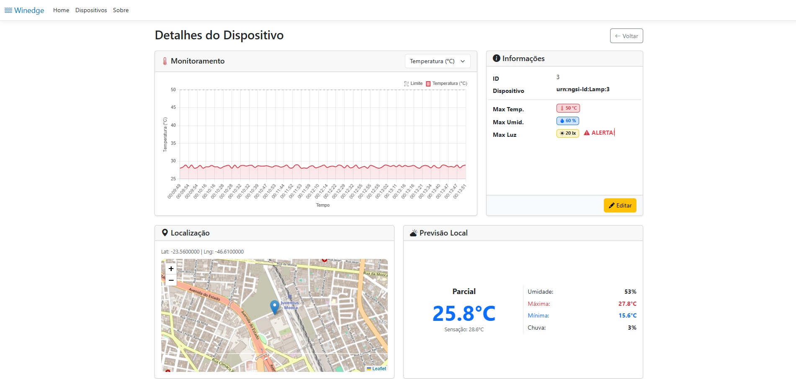
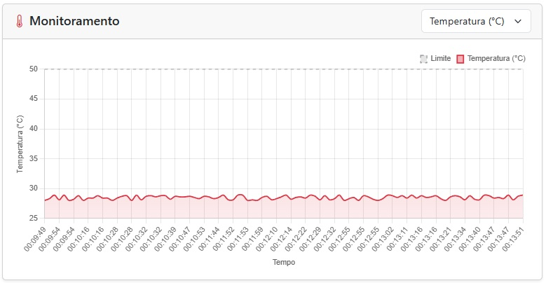
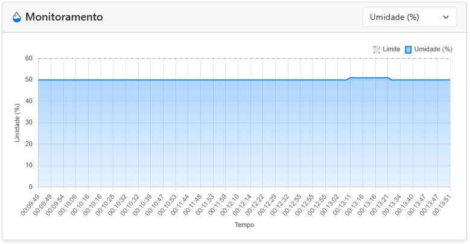
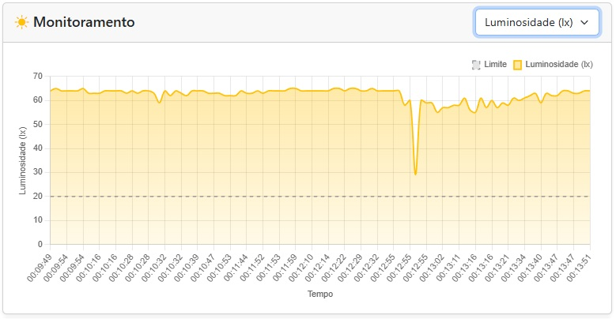
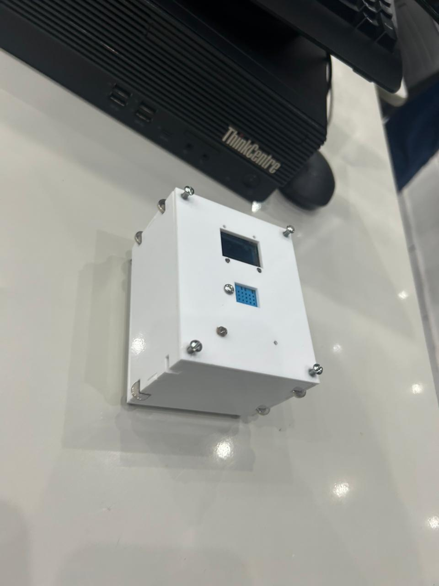
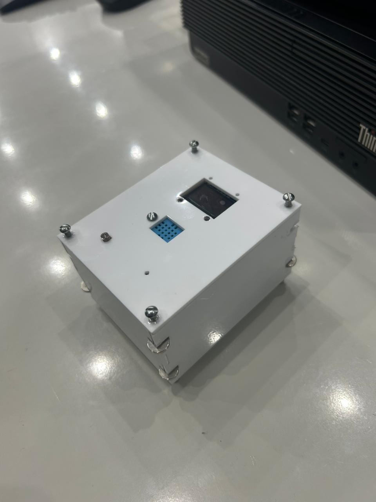
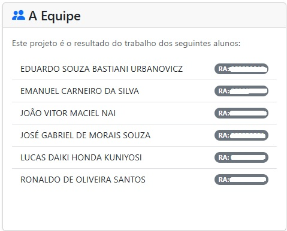

# 📡 IoT Portal MVC + ESP32 + FIWARE

<p align="center">
  
</p>

<p align="center">
  <strong>Sistema inteligente de monitoramento e controle IoT em tempo real</strong><br>
  ASP.NET MVC • ESP32 • FIWARE
</p>

---

## 🌐 Sobre o Projeto

O **IoT Portal MVC** é uma solução completa para monitoramento remoto de dispositivos IoT, permitindo visualizar dados ambientais em tempo real, definir limites críticos e acionar alertas automáticos com buzzer via ESP32, tudo integrado ao ecossistema **FIWARE**.

---

## 🧠 Arquitetura do Sistema

```
[ App Android ]
        ↓
Configuração Wi-Fi do ESP32
        ↓
[ ESP32 + Sensores ]
        ↓ MQTT
[ FIWARE IoT Agent ]
        ↓
[ Orion Context Broker ]
        ↓
[ STH-Comet ]
        ↓
[ Portal MVC ASP.NET ]
```

```
[ ESP32 + Sensores ]
        ↓ MQTT
[ FIWARE IoT Agent ]
        ↓
[ Orion Context Broker ]
        ↓
[ STH-Comet ]
        ↓
[ Portal MVC ASP.NET ]
```

Componentes:

* 📱 **App Android** – Configura a rede Wi-Fi do ESP32
* 🌐 **Portal Web (.NET MVC)** – Interface de monitoramento
* 🔌 **ESP32** – Dispositivo IoT com sensores físicos
* ☁️ **FIWARE** – Gerenciamento de contexto e comunicação

---

## ⚙️ Tecnologias Utilizadas

### 💻 Dashboard Web

* ASP.NET MVC
* Entity Framework Core
* SQL Server
* Bootstrap 5
* Chart.js
* Leaflet.js
* JavaScript

### 🔧 IoT

* ESP32
* MQTT

### ☁️ Plataforma FIWARE

* Orion Context Broker
* IoT Agent MQTT
* STH-Comet

---

## 📱 Aplicativo Android (Configuração Bluetooth)

O sistema conta com um **aplicativo Android dedicado** que se conecta ao ESP32 via **Bluetooth** para realizar a configuração inicial da rede Wi-Fi.

Funções do aplicativo:

✔ Seleção de redes Wi-Fi disponíveis
✔ Envio de SSID e senha ao ESP32
✔ Configuração sem necessidade de cabo
✔ Interface amigável para o usuário
✔ Provisionamento rápido do dispositivo

Fluxo de uso:

1. Usuário abre o app Android
2. Conecta ao ESP32 via Bluetooth
3. Seleciona a rede Wi-Fi
4. O ESP32 conecta-se automaticamente à internet

---

## 📋 Funcionalidades Principais

✔ Monitoramento em tempo real
✔ Gráficos dinâmicos com histórico
✔ Definição de limites por sensor
✔ Alertas visuais automáticos
✔ Acionamento de buzzer remoto
✔ Localização via mapa interativo
✔ Clima local em tempo real

---

## 🔔 Sistema Inteligente de Alertas

Quando um valor ultrapassa o limite configurado, o sistema envia automaticamente o comando ao FIWARE:

### 📢 Comando enviado (limite excedido):

```json
{
  "buzzer_on": {
    "type": "command",
    "value": "buzzer_on"
  }
}
```

### ✅ Comando enviado (condição normal):

```json
{
  "buzzer_off": {
    "type": "command",
    "value": "buzzer_off"
  }
}
```

---

## 🔌 Firmware ESP32 (Resumo)

O ESP32:

* Envia dados via MQTT
* Recebe comandos do FIWARE

Comandos suportados:

* 🟢 `on` → Liga LED
* 🔴 `off` → Desliga LED
* 🔊 `buzzer_on` → Ativa buzzer
* 🔇 `buzzer_off` → Desativa buzzer

---

## 📊 Interface Web

### 📈 Dashboard

<p align="center">
  
</p>

### 📉 Gráficos dos Sensores

<p align="center">
  
  
  
</p>

---

## 📍 Dispositivo Físico (Protótipo)

<p align="center">
  
  
</p>

---

## 👨‍💻 Autores

<p align="center">
  
</p>

---